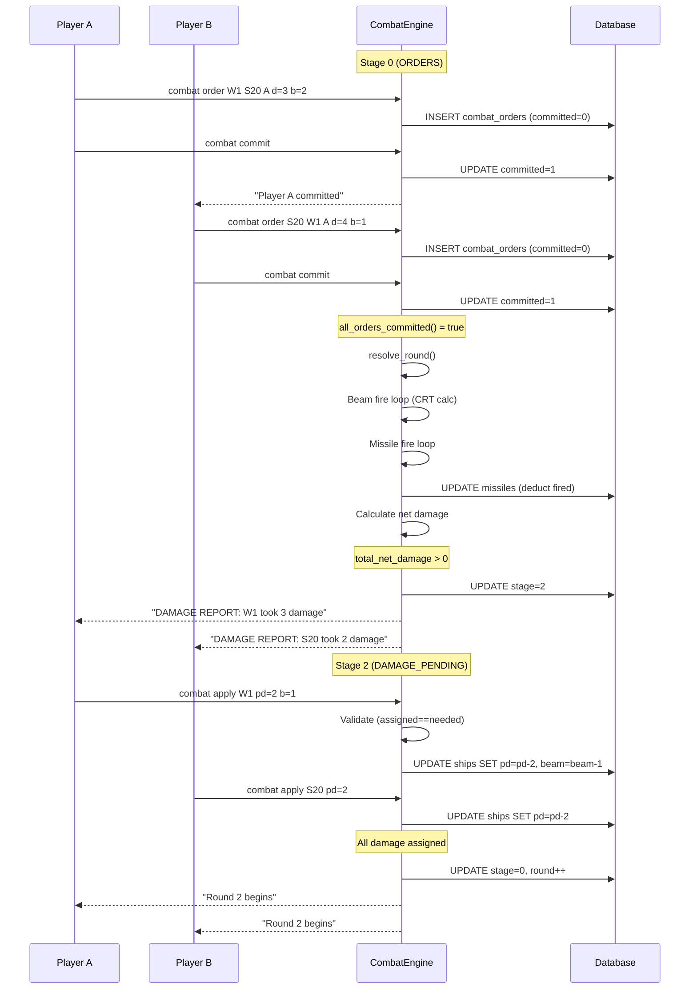
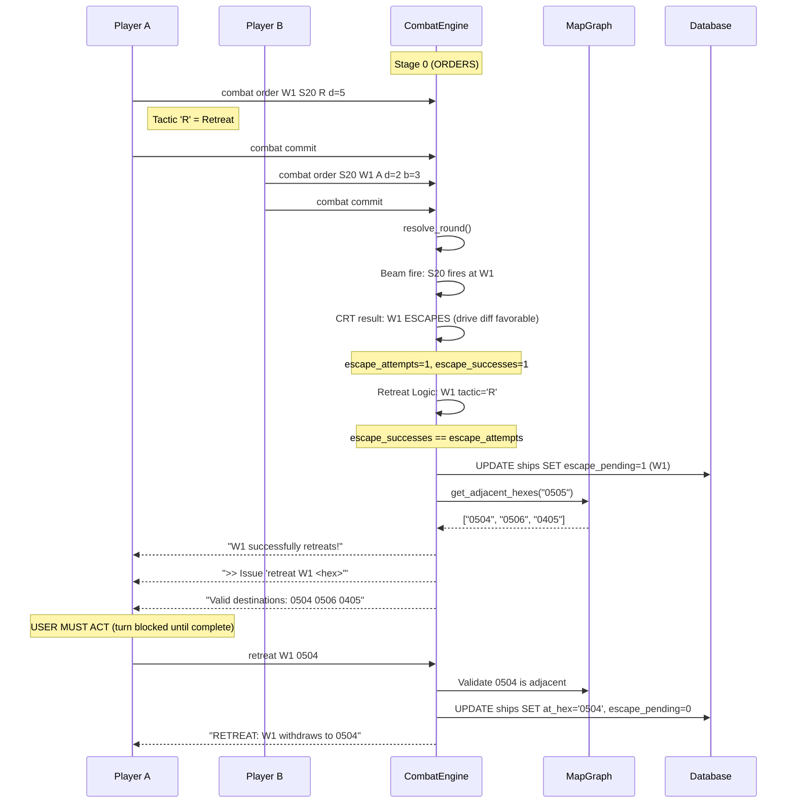
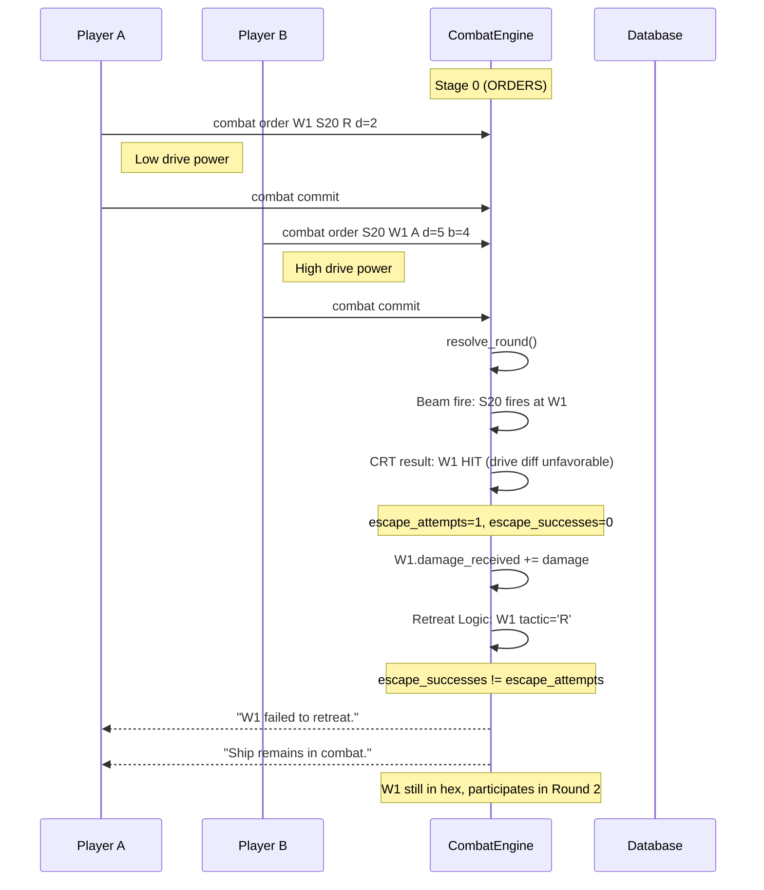
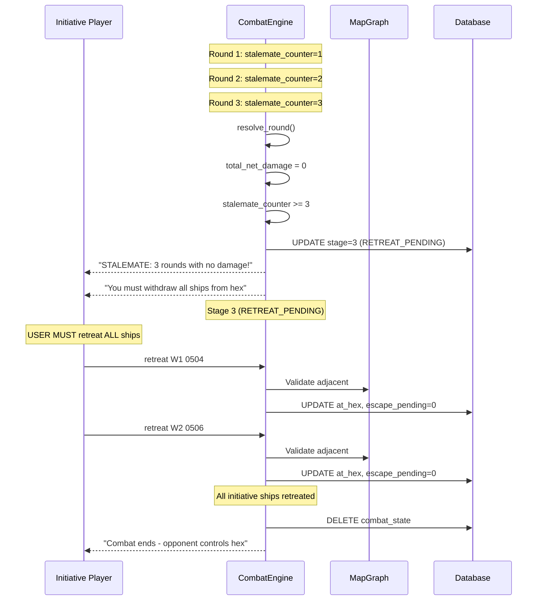
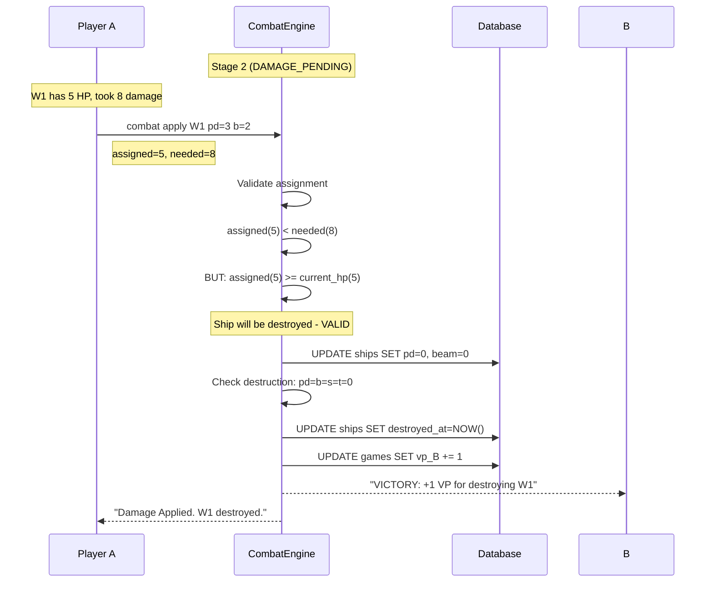
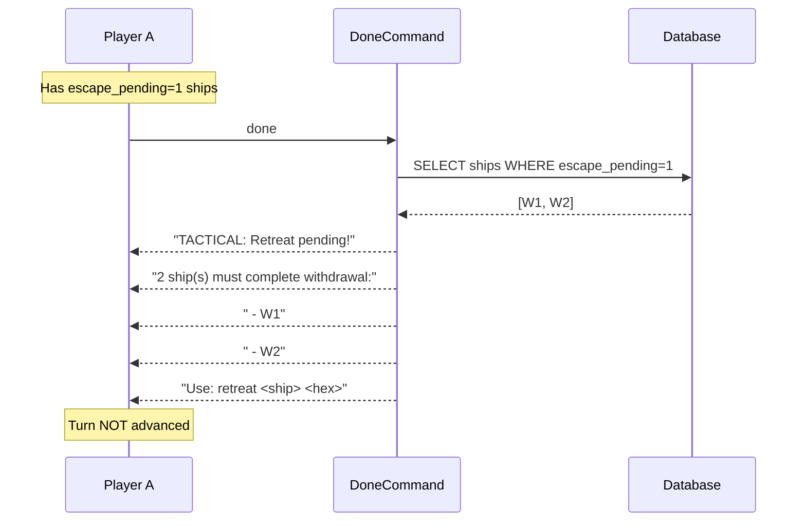

# Combat Decision Tree

## Combat Stages
- **Stage 0**: ORDERS - Awaiting combat orders
- **Stage 1**: RESOLVE_READY - Ready to resolve (all committed)
- **Stage 2**: DAMAGE_PENDING - Awaiting damage assignment
- **Stage 3**: RETREAT_PENDING - Awaiting retreat commands (stalemate)

---

## Scenario 1: Normal Combat Round (Damage Dealt)



---

## Scenario 2: Successful Retreat



---

## Scenario 3: Failed Retreat



---

## Scenario 4: Stalemate (3 Rounds No Damage)



---

## Scenario 5: Ship Destruction (Overkill)



---

## Scenario 6: Turn Blocked by Pending Retreat



---

## Decision Tree

```
┌─────────────────────────────────────────────────────────────────────┐
│                     COMBAT TRIGGERED                                 │
│  System: create_combat() inserts combat_state with stage=0          │
│  System: Notifies both players of combat in hex                     │
└─────────────────────────────────────────────────────────────────────┘
                                  │
                                  ▼
┌─────────────────────────────────────────────────────────────────────┐
│                     STAGE 0: ORDERS                                  │
├─────────────────────────────────────────────────────────────────────┤
│  USER A: 'combat order <ship> <target> <tactic> [power alloc]'      │
│  USER A: 'combat commit' (marks orders committed)                    │
│  USER B: 'combat order <ship> <target> <tactic> [power alloc]'      │
│  USER B: 'combat commit' (marks orders committed)                    │
├─────────────────────────────────────────────────────────────────────┤
│  System checks: all_orders_committed()?                              │
│    NO  → Stay in Stage 0, notify waiting player                     │
│    YES → Call resolve_round()                                        │
└─────────────────────────────────────────────────────────────────────┘
                                  │
                     all_orders_committed() == true
                                  │
                                  ▼
┌─────────────────────────────────────────────────────────────────────┐
│                     resolve_round() EXECUTION                        │
├─────────────────────────────────────────────────────────────────────┤
│  Ship Loading: SELECT ... WHERE escape_pending=0                    │
│  (Ships pending retreat are EXCLUDED from combat)                   │
├─────────────────────────────────────────────────────────────────────┤
│  1. BEAM FIRE LOOP (for each ship in hex)                           │
│     ├─ IF power_b > 0 AND has target:                               │
│     │     System: Calculate CRT result                              │
│     │     System: Track escape_attempts/escape_successes on TARGET  │
│     │     System: Apply damage to target.damage_received            │
│     ├─ ELSE IF tactic == 'R':                                       │
│     │     System: Log "holds fire (Retreating)"                     │
│     └─ ELSE:                                                        │
│           (ship not attacking, no special action)                   │
├─────────────────────────────────────────────────────────────────────┤
│  2. MISSILE FIRE LOOP (for each ship in hex)                        │
│     ├─ IF missiles_data not empty AND power_t >= count:             │
│     │     System: Calculate CRT for each missile                    │
│     │     System: Track escape_attempts/escape_successes on TARGET  │
│     │     System: Apply damage to target.damage_received            │
│     │     System: DEDUCT missiles from ships.missiles               │
│     └─ ELSE:                                                        │
│           (no missiles fired)                                       │
├─────────────────────────────────────────────────────────────────────┤
│  3. NET DAMAGE CALCULATION (for each ship)                          │
│     System: net = damage_received - (power_s * shield_absorb)       │
│     System: Sum total_net_damage                                    │
├─────────────────────────────────────────────────────────────────────┤
│  4. RETREAT LOGIC (for each ship with tactic == 'R')                │
│     ├─ IF escape_attempts == 0 (unopposed):                         │
│     │     escape = true                                             │
│     ├─ ELSE IF escape_successes == escape_attempts (eluded all):    │
│     │     escape = true                                             │
│     └─ ELSE:                                                        │
│           escape = false                                            │
│                                                                      │
│     ├─ IF escape == true:                                           │
│     │     System: SET escape_pending=1                              │
│     │     System: Use MapGraph to list valid hexes                  │
│     │     System: Log "successfully retreats! Issue 'retreat...'"  │
│     │     ──► USER MUST: 'retreat <ship> <hex>'                    │
│     │         (Turn blocked until complete - enforced in Turn.cpp) │
│     │                                                                │
│     └─ ELSE (escape == false):                                      │
│           System: Log "failed to retreat. Ship remains in combat." │
│           (Ship continues in next round)                            │
└─────────────────────────────────────────────────────────────────────┘
                                  │
                                  ▼
┌─────────────────────────────────────────────────────────────────────┐
│                     BRANCH: total_net_damage > 0?                    │
├──────────────────────────────┬──────────────────────────────────────┤
│           YES                │              NO                       │
│    Stage → 2 (DAMAGE)        │    stalemate_counter++                │
│    Reset stalemate           │                                       │
│                              │    IF stalemate >= 3:                 │
│                              │       Stage → 3 (RETREAT_PENDING)     │
│                              │       System: Notify initiative       │
│                              │         player must withdraw all      │
│                              │    ELSE:                              │
│                              │       next_round++                    │
│                              │       Stage → 0 (back to ORDERS)      │
│                              │       System: Broadcast next round    │
└──────────────────────────────┴──────────────────────────────────────┘
                │                              │
                ▼                              │
┌───────────────────────────────┐              │
│  STAGE 2: DAMAGE_PENDING      │              │
├───────────────────────────────┤              │
│  USER A (if has damage):      │              │
│    'combat apply <ship>       │              │
│     pd=N b=N s=N t=N m=N'     │              │
│                               │              │
│  USER B (if has damage):      │              │
│    'combat apply <ship>       │              │
│     pd=N b=N s=N t=N m=N'     │              │
├───────────────────────────────┤              │
│  VALIDATION:                  │              │
│  ├─ assigned > needed:        │              │
│  │   ├─ assigned >= HP: OK    │              │
│  │   │   (overkill accepted)  │              │
│  │   └─ assigned < HP: ERROR  │              │
│  │                            │              │
│  ├─ assigned < needed:        │              │
│  │   ├─ assigned >= HP: OK    │              │
│  │   │   (ship destroyed)     │              │
│  │   └─ assigned < HP: ERROR  │              │
│  │                            │              │
│  └─ assigned == needed: OK    │              │
├───────────────────────────────┤              │
│  System: Apply to attributes  │              │
│  System: Check destruction    │              │
│    IF pd=b=s=t=0:             │              │
│       destroyed_at=NOW()      │              │
│       Award VP to enemy       │              │
├───────────────────────────────┤              │
│  All damage assigned?         │              │
│    NO  → Stay Stage 2         │              │
│    YES → Check combat end     │              │
│      ├─ One side eliminated:  │              │
│      │   DELETE combat_state  │              │
│      │   Combat ENDS          │──────────────┼────► EXIT
│      └─ Both sides remain:    │              │
│          next_round++         │              │
│          Stage → 0            │◄─────────────┘
└───────────────────────────────┘

                                  │  (from stalemate >= 3)
                                  ▼
┌─────────────────────────────────────────────────────────────────────┐
│                     STAGE 3: RETREAT_PENDING (Stalemate)            │
├─────────────────────────────────────────────────────────────────────┤
│  Initiative player MUST retreat ALL ships from hex                  │
│                                                                      │
│  USER (initiative): 'retreat <ship> <hex>' for EACH ship            │
│                                                                      │
│  System: Validates via MapGraph::get_adjacent_hexes()               │
│  System: Moves ship, clears escape_pending                          │
├─────────────────────────────────────────────────────────────────────┤
│  All initiative ships retreated?                                    │
│    YES → Combat ENDS (other player controls hex)                    │
│    NO  → Turn blocked (enforced in DoneCommand)                     │
└─────────────────────────────────────────────────────────────────────┘
```

---

## Enforcement Mechanisms (All Implemented)

| Gap | Fix Location | Implementation |
|-----|--------------|----------------|
| Turn advance with pending retreat | `Turn.cpp` DoneCommand | Query `escape_pending=1`, block if found |
| Ship in combat with pending retreat | `Combat.cpp` resolve_round | Ship load query includes `AND escape_pending=0` |

---

## Summary: User vs System Responsibilities

| State | User Action | System Action |
|-------|-------------|---------------|
| Combat Triggered | - | create_combat(), notify players |
| Stage 0 | `combat order`, `combat commit` | Validate, store, check all committed |
| Resolution | - | CRT, damage calc, retreat detection |
| Stage 2 | `combat apply <ship> <assignments>` | Validate assignment, apply, check destruction |
| Retreat Success | `retreat <ship> <hex>` | Validate hex (MapGraph), move ship |
| Stage 3 | `retreat <ship> <hex>` (all ships) | Validate, end combat |
| Turn Advance | `done` or `next` | **BLOCK if escape_pending** |
